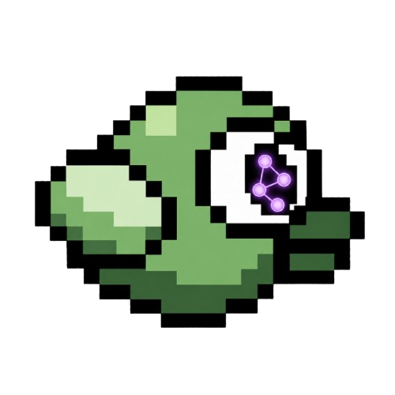

# FLAP-1

<p align="center">
  
</p>

<p align="center"><strong>Flight Learner with Adaptive Policy</strong></p>

FLAP-1 is a reinforcement-learning experiment that teaches a small spatial CNN
to play Flappy Bird from a stack of grayscale frames.

The project uses PPO, a C++ Flappy Bird environment, and TensorFlow. The agent
sees the actual upper and lower pipes as 42x42 grayscale observations, chooses
between `no flap` and `flap`, and learns from score progress, survival, and the
collision signal.

## What Is Here

- A deterministic C++ Flappy Bird simulation with a Python environment API.
- A spatial CNN actor and critic trained with Proximal Policy Optimization.
- Frame stacking: five 42x42 grayscale frames per policy decision.
- C++ vectorized rollouts for the real game simulation, plus a fast Python
  approximation for focused tests.
- Deterministic and stochastic checkpoint validation on fixed seed ranges.
- Checkpoint comparison on paired seeds.
- A Tkinter checkpoint watcher with game view, exact observation stack,
  telemetry, optional native C++ window, and 60 Hz playback rendering.

## The Model

`FLAP` stands for **Flight Learner with Adaptive Policy**. The current model is
`FLAP-1`: a convolutional actor-critic that receives the last five rendered
frames and selects one of two actions every four simulation ticks.

| Component | Current design |
| --- | --- |
| Input | `42 x 42 x 5` grayscale frame stack |
| Actions | `0`: no flap, `1`: flap |
| Policy/value network | Spatial CNN with separate actor and critic heads |
| Optimizer family | PPO with clipped policy updates and KL monitoring |
| Environment | C++ Flappy Bird simulation, normally 32 parallel environments |
| Rewards | small survival reward, `+10` per pipe, `-1` on death |

The compact observation space is intentional: this is a control problem with
temporal state, not an image-classification task.

## Requirements

The repository is developed with [devenv](https://devenv.sh/) and Nix. The
development shell supplies Python 3.13, TensorFlow, NumPy, Tkinter, CMake, GLFW,
and the native dependencies needed by the C++ environment.

```bash
devenv shell
```

For non-Nix setups, install equivalent Python and C++ dependencies, then ensure
the native environment can be built with CMake. The Nix shell is the supported
route.

## Build the Environment

```bash
cmake -S lib/flappy-bird-env -B lib/flappy-bird-env/build
cmake --build lib/flappy-bird-env/build --target flappy_env_server flappy_env_vector_server
```

Run the interactive environment demo:

```bash
devenv tasks run flappyrl:libdemo
```

This opens the normal game view and the low-resolution observation view. The
latter is the observation received by the policy.

## Train

The maintained training task builds the native servers and resumes the current
stable long-horizon branch from the validated fixed-observation checkpoint:

```bash
devenv tasks run flappyrl:train
```

Training uses the C++ vector backend with 32 environments and periodic
deterministic/stochastic validation. Checkpoints are written below
`checkpoints/`; the task definition is updated for each new experiment.

For custom runs, inspect `train/training.py --help` and start from the task in
`devenv.nix`. Important controls include rollout size, actor/critic learning
rates, gamma, entropy schedule, KL target, checkpoint directory, and validation
seed range.

## Watch a Checkpoint

The Tkinter watcher loads a checkpoint, lets you choose a seed and deterministic
or stochastic action selection, then shows the game, exact frame stack, score,
and verbose telemetry.

```bash
devenv tasks run flappyrl:demo
```

The watcher runs TensorFlow during startup and displays a loading screen until
the runtime is ready. Playback preserves the trained four-tick action cadence
while rendering intermediate simulation ticks at 60 Hz.

For a simpler native-window player:

```bash
python3 -m train.watch_checkpoint \
  checkpoints/spatial-cnn-fixed-observation-static-gamma-995-low-actor-lr-entropy-warmup/best/ckpt-290
```

## Compare Checkpoints Properly

Use the same deterministic seeds for both candidates:

```bash
python3 -m train.compare_checkpoints \
  --baseline checkpoints/run-a/best/ckpt-100 \
  --candidate checkpoints/run-b/best/ckpt-120 \
  --episodes 100 \
  --batch-size 20
```

The comparison reports paired score differences, wins/losses/ties, and a
normal-approximation confidence interval. Twenty convenient seeds are useful
for progress signals but do not provide a robust estimate of generalization.

## Checks

Run the complete project suite with devenv:

```bash
devenv test
```

The test command builds the native servers, then runs the PPO, checkpoint,
playback, single-environment, and vector-environment checks in `test/`.

## Repository Map

```text
src/                         PPO, actor, critic, configuration, environment adapters
train/training.py            Training loop, validation, checkpointing, memory guard
train/watch_gui.py           Tkinter checkpoint watcher
train/compare_checkpoints.py Paired-seed checkpoint evaluation
test/                        Project test suite
lib/flappy-bird-env/         C++ game, RL renderer, servers, Python environment API
devenv.nix                   Development shell, demos, training, and test command
```

## Credits

The native environment is built on the OpenGL engine created by
[FRBFStudios](https://github.com/FRBFStudios) and the base Flappy Bird game
created by [TP-xx](https://github.com/TP-xx). Both are part of the upstream
[TS-Code-Studios/flappy-bird](https://github.com/TS-Code-Studios/flappy-bird)
project. FLAP-1 adds the reinforcement-learning environment, observation
pipeline, policy training, and checkpoint tooling.

## Notes on Reproducibility

The C++ environment accepts explicit seeds. Training, validation, checkpoint
restoration, and checkpoint comparison preserve or control the relevant random
state where practical. A score can still vary under stochastic action sampling;
that is an expected consequence of sampling from the learned action
distribution.

FLAP-1 is experimental software and does not claim to solve Flappy Bird.
